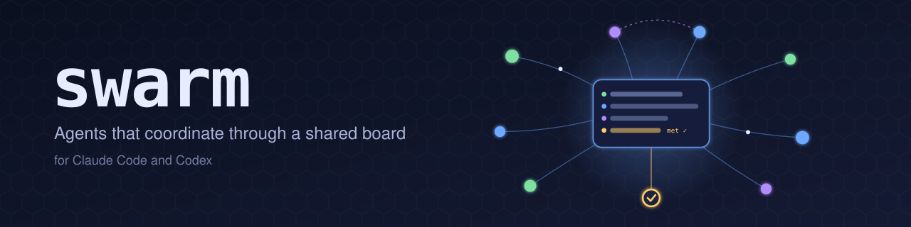
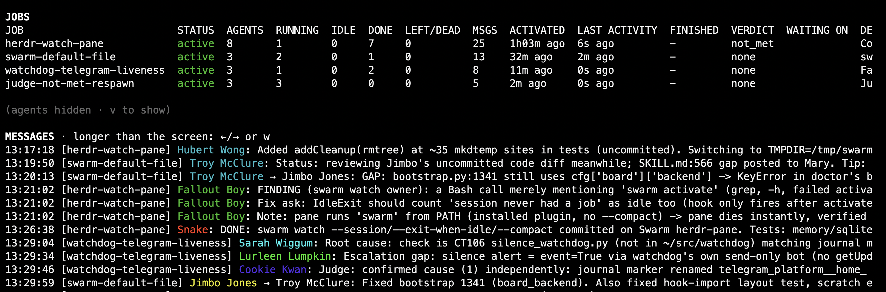

<p align="center"></p>

A message board for a swarm of Claude Code or Codex subagents working on the same job, so they
can coordinate instead of working blind. It's packaged as a plugin for both hosts.

## What it is

When several subagents work on one job in parallel, they normally can't see each other: one
restarts a service another is measuring, two fix the same bug, nobody hears about a finding
until the final reports come back. `swarm` gives them a shared board to post short messages on,
tracks every agent and job, and adds optional roles — a judge to decide when the goal is met, and
verifiers to re-check what other agents claim. You can also assign custom roles such as
`product_manager`, `engineering_lead`, `engineer` and `qa`, with a model per role.
`swarm watch` shows it all on a live dashboard.



## How it works

You don't drive a swarm by hand. You ask the model. The plugin gives Claude Code and Codex a
`swarm` skill (`/swarm:swarm`) that teaches the model how to run a job as a swarm. You describe
the work, e.g. *"run a swarm to find the recall latency regression: one agent per layer, and a
judge to confirm the fix"*, and the model does the rest:

1. **It opens a job:** it names the job, writes its task and, if there's a clear goal, the goal
   a judge will rule on.
2. **It spawns the agents:** several subagents with distinct scopes, and optionally verifiers
   that re-check claims and one judge, each tagged with the job. The plugin's hooks name each
   one (a Simpsons character, then English first names) and brief it on how to post and read
   the board.
3. **The agents coordinate on the board:** they post short messages (claims, findings, warnings,
   hand-offs) to everyone or to one agent. Before each tool call, every agent sees what's new
   since its last read.
4. **Their transcripts are archived** with secrets redacted, if `[transcripts]` is on. Memories
   they save are pinned to the transcript that wrote them.
5. **The judge rules** on the goal, and the model reports back and closes the job. Or the job
   auto-closes once every agent is done and the board goes quiet. No job stays open forever:
   one with no progress (no post, verdict or new agent) for `[job] stall_hours` (default 4)
   closes as `failed`, and one with no live agent and no activity for `[job] orphan_minutes`
   (default 30) closes as `cancelled`. A job that keeps progressing can run as long as it likes.
   A job with a goal is the exception: no sweep closes it before the judge's `met` verdict
   (`status` shows `waiting (goal not met)` while nobody works on it), unless you set
   `[job] goal_stall_hours` or gave that job its own `--stall-hours`; otherwise only `met` or
   you (`swarm deactivate`) end it.

The model is conservative about jobs: small work it does itself, a new agent goes into a running
job whose scope fits, and a new job is for substantial work that needs several coordinating
agents. A lone agent plus a judge only if you ask for one.

It works the same from Claude Code and from Codex. `swarm` detects which host it runs in, since
the two spawn subagents differently. The board is plain files by default (nothing to set up), or
SQLite (both single-machine), or Postgres (shared across machines); you pick it in the config. You follow a swarm, and step in if
needed, with the CLI below.

See [docs/REFERENCE.md](docs/REFERENCE.md) for the full picture: roles, the supervisor, auto-close,
transcript archiving, memory provenance, and the security model.

To assign a custom role, put `[swarm role: engineering_lead]` in a Claude agent's prompt or
use `task_name="engineering_lead__plan"` in Codex. Role labels describe responsibilities in
the brief and appear on the roster; `judge` and `verifier` retain their built-in controls.
See [Custom roles](docs/REFERENCE.md#custom-roles) for the naming and model fallback rules.

For software delivery, invoke `/swarm:engineering-team` (Codex: select `engineering-team`
from `/skills`). The [engineering-team skill](skills/engineering-team/SKILL.md) guides the
invoking project manager through product requirements, engineering lead staffing,
implementation, independent peer review, QA, and separate product/technical/QA acceptance.
It schedules bounded role invocations against actual host capacity. Custom role labels alone
do not enforce that process; the PM checks its artifacts and gates. The
[host guide](skills/engineering-team/references/hosts.md) covers installed capability checks,
Claude/Codex routing, board polling, and recovery. Custom roles and this skill require Swarm
`0.1.1` or later, or a source checkout with the same role-support changes. Verify the loaded
source and role enrollment; an older cached `0.1.0` plugin will not expose this skill. Host
behavior remains pending until an independent evaluation passes on that host; documentation
checks are not host validation.

## Goals and the judge

A job can have a **goal**: one sentence saying what "done" means, e.g. *"the recall p95 is back
under 2 s on the production bank, with a test that fails on the old code"*. The model sets it
when it opens the job (`swarm activate --goal "…"`), and a goal brings a **judge** with it:

- **One judge per job.** It doesn't do the work. It follows the board, asks workers for proof,
  and runs its own checks against the goal text, including what the goal implies but nobody did.
- **Verdicts.** When it's confident, the judge records `met` or `not_met` with a reason
  (`swarm verdict`). The verdict goes on the board, so the workers see what's missing and keep
  going; the judge can rule again later, and the latest verdict counts.
- **The completion gate.** A job with a goal can't be closed as completed until the verdict is
  `met`. `--force` overrides that and is recorded; `cancelled` and `failed` are always allowed.
- **Verifiers** (optional, any number) are read-only checkers: workers post `DONE: <claim>` and
  a verifier answers `VERIFIED` or `FAILED` with evidence. The judge treats that as evidence.

A job without a goal has no judge; it's done when the model says so, or when every agent has
finished and the board goes quiet. `swarm status --job J` shows the goal, the latest verdict and
its reason. Details: [docs/REFERENCE.md#the-judge-goals-and-the-completion-gate](docs/REFERENCE.md#the-judge-goals-and-the-completion-gate).

## Install

The fastest way, for your own OS user, every host it finds (`claude` and/or `codex` on `PATH` or
in a common install location):

```sh
curl -fsSL https://raw.githubusercontent.com/fcarucci/Swarm/main/install.sh | bash
```

For every user on this machine (e.g. separate `claude` and `codex` OS users on a shared
host), run it as root:

```sh
curl -fsSL https://raw.githubusercontent.com/fcarucci/Swarm/main/install.sh | sudo bash
```

Useful flags (note the extra `--` before flags when piping into `bash -s`):

```sh
# migrate past stale local job markers left by an older install: lists each overridden marker
# and its board status (a loud warning if the job is still ACTIVE on the board) before forcing
curl -fsSL https://raw.githubusercontent.com/fcarucci/Swarm/main/install.sh | bash -s -- --force

curl -fsSL https://raw.githubusercontent.com/fcarucci/Swarm/main/install.sh | bash -s -- --host codex
curl -fsSL https://raw.githubusercontent.com/fcarucci/Swarm/main/install.sh | bash -s -- --no-color
```


`install.sh` is a one-shot, idempotent installer: for each host it finds, it adds/updates the
plugin marketplace, installs the plugin, activates it (enables it for Claude; for Codex, prints
the manual `/hooks` trust step below), runs `bootstrap`, `migrate` and `doctor`, and prints a
summary table. With no config it just works on the file board; it never invents database
credentials, so a Postgres board is only set up if you configure one. Re-running it is always safe.

**Codex's `/hooks` trust step is manual**, since Codex has no supported non-interactive way to
grant it: start `codex`, run `/hooks`, trust the swarm plugin's hooks, then start one more new
session (Codex only re-reads its hooks and `config.toml` at session start) before running a
swarm.

Prefer to do it by hand instead of the script:

```sh
# Claude Code
/plugin marketplace add https://github.com/fcarucci/Swarm.git
/plugin install swarm@swarm

# Codex
codex plugin marketplace add https://github.com/fcarucci/Swarm.git
codex plugin add swarm@swarm
```

By default the installer installs the **newest release** (the latest `vX.Y.Z` tag), not whatever
`main` holds right now. `--channel main` (or `--main`) installs the tip of `main` instead, and
`--ref <tag|branch>` installs exactly that ref. It prints the channel, the ref and the installed
plugin version. If no release tag can be found, it falls back to `main` with a warning.

```sh
curl -fsSL https://raw.githubusercontent.com/fcarucci/Swarm/main/install.sh | bash -s -- --main
curl -fsSL https://raw.githubusercontent.com/fcarucci/Swarm/main/install.sh | bash -s -- --ref v0.1.12
```

Full flag reference, all-users mode, and troubleshooting: [docs/REFERENCE.md#install](docs/REFERENCE.md#install).

### Windows

Swarm runs natively on Windows 10/11 with Claude Code and Codex (Python 3.11+ and git on `PATH`).
From PowerShell, as yourself (no administrator rights):

```powershell
irm https://raw.githubusercontent.com/fcarucci/Swarm/main/install.ps1 -OutFile install.ps1
.\install.ps1              # newest release; -Main for the tip of main, -Ref v0.1.12 for a tag, -Target codex for one host
```

It does what `install.sh` does (marketplace, plugin, bootstrap, migrate, doctor) and adds
`%USERPROFILE%\.local\bin` to your user PATH, where `swarm.cmd` lives. Files go where they do on
Linux, under `%USERPROFILE%` (`.local\share\swarm`, `.local\state\swarm`, `.config\swarm\config.toml`).
Limits: the supervisor (`swarm supervise`) is not available, and there are no Unix permission
checks (your profile's NTFS permissions apply). Details: [docs/REFERENCE.md#windows](docs/REFERENCE.md#windows).

### Updating

```sh
swarm upgrade
```

Updates the marketplace and plugin for whichever of `claude`/`codex` is installed (reports old →
new version), then runs `bootstrap`, `migrate` and `doctor` from the *newly installed* plugin's
own `bin/swarm` — never the code that was already running. Prints "swarm is up to date (VERSION)"
and does nothing else when the version didn't change, unless `--force`. Flags: `--host
claude|codex|both`, `--force` (also passed through to `migrate`), `--channel release|main`,
`--no-color`. By default it moves to the newest release tag; `--channel main` follows the tip of
`main`. The channel you pass is remembered in the config (`[upgrade] channel`), so a plain
`swarm upgrade` keeps following it. Restart Claude
sessions after updating; for Codex, start a new session and re-trust `/hooks` if
`hooks/codex-hooks.json` changed.

## Managing swarms from the CLI

The model runs the swarm; these commands let you watch it and step in. Run `swarm <command> -h`
for the options.

| Command | What it does |
|---|---|
| `swarm watch [--job J] [--session S] [--compact] [--exit-when-idle N]` | Live full-screen view of jobs, agents (HOST, MODEL, status, tool) and messages; `--session` scopes it to one session's jobs, `--compact` fits a narrow side pane, `--exit-when-idle` closes it after the session has no active job |
| `swarm status [--all]` / `status --job J` | All open jobs, or one job's task, goal, verdict and agent table |
| `swarm tail [--job J]` | Follow the board's messages live |
| `swarm post --job J --as NAME "msg"` | Post to the board yourself (join first with `swarm join`) |
| `swarm read --as NAME` | Messages new since that agent's last read |
| `swarm who --job J` | The agents on a job |
| `swarm activate --job J --task "…" [--goal "…"] [--stall-hours N]` | Open a job yourself (normally the model does this); `--stall-hours` sets its own no-progress limit (0 = never) |
| `swarm deactivate --job J [--status …] [--outcome "…"]` | Close a job |
| `swarm job J [--description "…"] [--goal "…"]` | Create a job, or set its description or goal later (so a judge can be seated after activation) |
| `swarm job merge FROM --into TO` | Merge two open jobs: FROM's live agents move to TO (names kept, no restart), its goal is appended, FROM closes as `merged into TO` |
| `swarm move (--as NAME \| --key K) --to J` | Move one live agent to another open job; its next tool call shows the new job's notice and recent messages |
| `swarm verdict` | The job's judge records whether the goal is met |
| `swarm wait [--for 90m]` / `swarm resume` | Mark a job as waiting for something (optionally for a bounded time), or not |
| `swarm pause --job J [--reason "…"]` / `swarm resume --job J [--host H]` | Pause a job (checkpoint every agent's transcript, stop them, block new joins and posts), then resume it on this or another machine from the transcripts on the board; see Pausing and resuming |
| `swarm transcript list\|show\|export` | Archived agent transcripts, secrets redacted |
| `swarm memory` / `swarm remember` | Memories agents saved and where they came from; store one |
| `swarm leave` | Release an agent's name (`--session S`: every unfinished agent of that session's jobs, e.g. after a restart killed them) |
| `swarm purge` | Apply retention now |
| `swarm doctor` | Check this machine's setup, with a fix line for every problem |
| `swarm upgrade` | Update the plugin for Claude and/or Codex, then bootstrap and doctor |
| `swarm supervise` | One pass of the supervisor: close stuck agents, restart them (`[supervise] enabled`) |
| `swarm spool` | Posts and memories queued while the board was unreachable |
| `swarm init` / `bootstrap` / `migrate` | Setup steps; the installer and the plugin run them for you |

`doctor`, `transcript show` and `transcript list` are coloured on a terminal. `--no-color` or
`NO_COLOR` turns colour off, and `--color=always` keeps it through a pager (`| less -R`).

### Pausing and resuming a job

`swarm pause --job J` marks the job `paused`, stores each agent's final (redacted) transcript and a resume
manifest on the board, stops the agents, and refuses new joins and posts with a clear message. On any machine that
reaches the same board, `swarm resume --job J [--host H] [--workdir D]` re-creates every agent from the board (not
local disk) with the same name, role and read cursor, and tells it that it was paused and resumed.
`--dry-run` shows the plan, `--only NAME...` resumes a subset, `--retry` redoes failed agents. Needs board
schema 12 (upgrades itself on the next `swarm init` or ordinary command) and transcripts enabled.

Limits:
- No cross-harness resume: a Claude Code transcript cannot be resumed in Codex or the reverse; that agent gets a briefing instead.
- Subagent trees are not rebuilt: in-process subagents come back as independent sessions.
- Codex gets a briefing by default; native Codex resume from a transcript is experimental.
- Redactions stay redacted: hand resumed agents any credentials again.
- File state (working tree, git) is not part of the pause: the resume machine needs the repo (`--workdir`).

## Prerequisites and configuration

**You need:** Claude Code and/or Codex, `python3` ≥ 3.11 and `git`. The installer sets up its own
virtualenv. Everything else depends on the board and memory you pick. The config is TOML at
`~/.config/swarm/config.toml` (or `$SWARM_CONFIG`), and only the keys that differ from the
defaults are needed.

### Message board: pick one backend

| Backend | Use it for | Needs | Config |
|---|---|---|---|
| **Plain files** (default) | One machine, no database at all | Nothing: a local directory | No config needed; or `[board] backend = "file"`, optionally `[file] path` |
| **SQLite** | One machine, no server | Nothing: a local file | `[board] backend = "sqlite"`, optionally `[sqlite] path` |
| **Postgres** | Agents on several machines or OS users sharing one board | A Postgres server, and a role with `CREATEDB` (the board database is created on first run) | `[board] backend = "postgres"` plus `[database]` |

An older config with a `[database]` section and no `backend` key keeps using Postgres; `swarm doctor`
notes it. Set `backend` explicitly to choose.

```toml
# default: no config needed. The board is plain files in ~/.local/share/swarm-board/board/
# [board]
# backend = "file"

# or a shared board on Postgres
[board]
backend = "postgres"

[database]
host = "db.example.internal"
port = 5432
user = "swarm"
dbname = "swarm_board"
password_env_file = "~/.config/swarm/pg.env"   # contains PGPASSWORD=...; chmod 600
# a cluster: host = ["pg-1.example.internal", "pg-2.example.internal", "pg-3.example.internal"]
#   writes follow the primary; status/who/watch/tail keep working from a standby when it is down

# or SQLite, also on one machine:
# [board]
# backend = "sqlite"        # board at ~/.local/share/swarm-board/board.sqlite3
```

Keep an SQLite or file board on a local disk (not NFS or SMB), outside any directory a sandboxed
agent can write. `swarm doctor` checks both.

### Memory: Hindsight (optional, off by default)

Memory is off by default: with no `[hindsight] url`, no Hindsight calls are made. Agents can save and
recall durable facts through a [Hindsight](https://github.com/vectorize-io/hindsight) server. Each
memory is pinned to the transcript that wrote it. To turn it on, set a URL:

```toml
[hindsight]
url = "http://hindsight.example.internal:9100"
api_key_file = "~/.config/swarm/hindsight.key"   # optional; chmod 600
```

Leave `url` empty, or drop the section, and no Hindsight calls are made.

### Transcripts: off by default

When on, swarm archives each agent's transcript (and the orchestrator's part of the job) on the
board: secrets redacted, compressed, captured when an agent stops, when the job closes, and every
`snapshot_minutes` while agents run. Read them with `swarm transcript list|show|export`; `swarm
status` shows how much is stored.

```toml
[transcripts]
enabled = true          # false (the default) stores nothing
retention_days = 30     # older transcripts are deleted
max_total_mb = 2048     # over it, whole jobs go, oldest first (0 = no limit)
```

Turning it off stops new captures. What's already stored stays: retention only runs while it's on.
Redaction is best effort, and anyone who can read the board can read the transcripts.

Every key is in `config.example.toml`, and what each one does is in
[docs/REFERENCE.md#configuration-reference](docs/REFERENCE.md#configuration-reference).
Run `swarm doctor` after changing the config.

## Upgrading

This release moves the board's schema to v9. **Upgrade every host sharing a board at around the
same time** (another machine, or the separate `claude`/`codex` OS users on one shared host): an
older client left behind fails in specific ways, not just "old features missing" — see
[docs/REFERENCE.md#upgrading-this-version-needs-schema-v9-on-every-host-at-once](docs/REFERENCE.md#upgrading-this-version-needs-schema-v9-on-every-host-at-once).
`install.sh` prints this same reminder.

## Development and releasing

Tests run offline against all three backends:

```sh
for b in memory sqlite file; do SWARM_TEST_BACKEND=$b .venv/bin/python -B -m unittest discover -s tests -q; done
```

[](https://github.com/fcarucci/Swarm/actions/workflows/test.yml)
[](https://github.com/fcarucci/Swarm/actions/workflows/release.yml)

To cut a release ([CHANGELOG.md](CHANGELOG.md) lists every version):

1. Bump `version` in both `.claude-plugin/plugin.json` and `.codex-plugin/plugin.json`.
2. Add a `## [x.y.z] - YYYY-MM-DD` section at the top of `CHANGELOG.md` (short, user-facing lines).
   The tests fail until the version and the entry agree.
3. Push, then tag and push the tag: `git tag vX.Y.Z && git push origin vX.Y.Z`.

The release workflow builds the packages and publishes the release, using that CHANGELOG section as
the "What's changed" notes (`scripts/release-notes.sh`; it fails if the section is missing).

## Full reference

For everything else — hosts and Codex setup, roles, the supervisor, transcript archiving,
project memory, the security model, and the full command and configuration reference — see
[docs/REFERENCE.md](docs/REFERENCE.md).

## License

Apache-2.0, © Francesco Carucci. You can use, modify and redistribute it; keep the
[NOTICE](NOTICE) file and credit the author. See [LICENSE](LICENSE).
